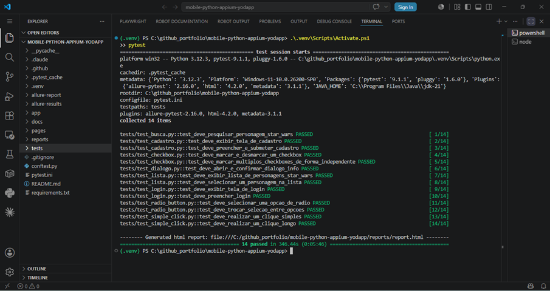
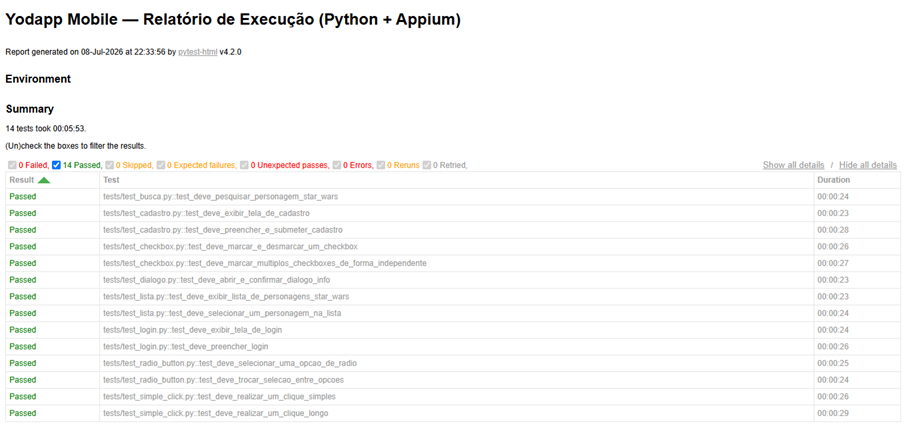
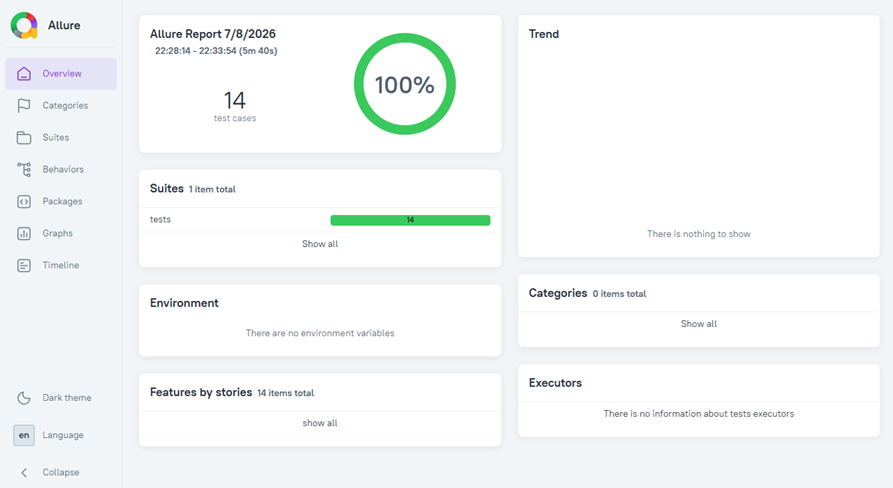
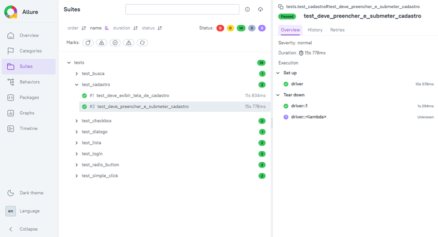
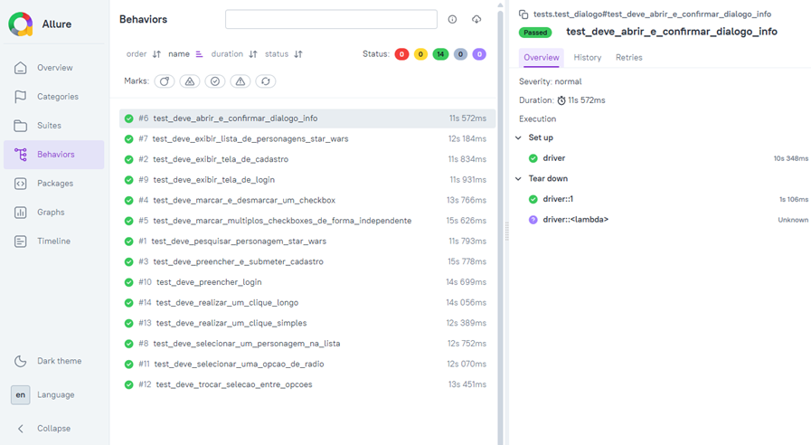
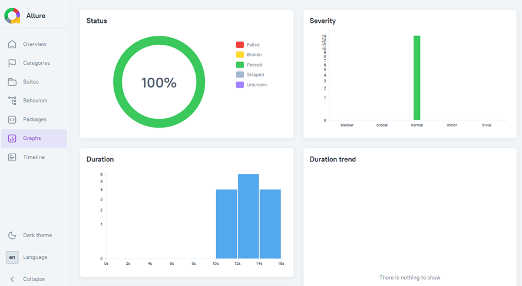
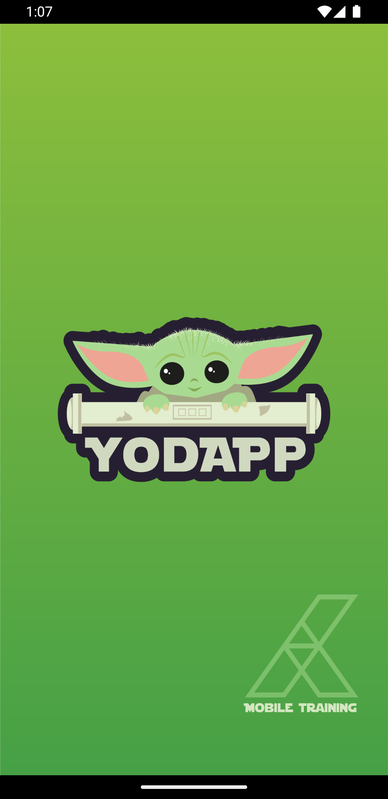
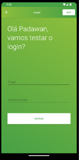
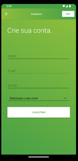
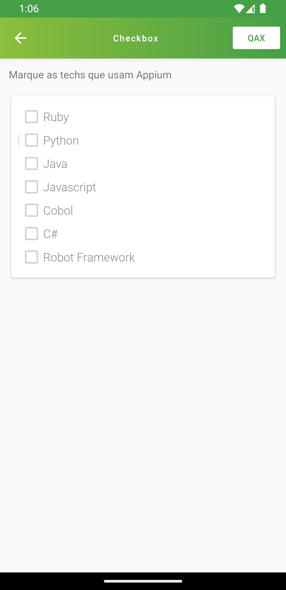

# Yodapp Mobile Automation — Python + Appium

Automação de testes Mobile (Android) do app **Yodapp — Mobile Training (by Papito)**, usando **Python + Appium + pytest**, com Page Object Model e pipeline CI/CD via GitHub Actions.

Este projeto substitui a versão anterior (Robot Framework) por uma stack em Python, ampliando a cobertura de testes.


## ⚠️ Status atual do projeto

Este projeto está em construção.

| Módulo | Status |
|---|---|
| Menu Hamburger / Navegação | ✅ Implementado e validado |
| Clique Simples | ✅ Implementado e validado |
| Clique Longo | ✅ Implementado e validado |
| Checkbox | ✅ Implementado e validado |
| Radio Button | ✅ Implementado e validado |
| Login | ✅ Implementado e validado |
| Cadastro | ✅ Implementado e validado |
| Lista | ✅ Implementado e validado |
| Busca | ✅ Implementado e validado |
| Diálogo (Dialogs) | ✅ Implementado e validado |

## 🚀 Como Começar

### 1. Clone o repositório

```bash
git clone https://github.com/moiseschiaretto/mobile-python-appium-yodapp.git
cd mobile-python-appium-yodapp
```

### 2. Crie e ative a venv, depois instale as dependências Python

```powershell
python -m venv .venv
.\.venv\Scripts\Activate.ps1
pip install -r requirements.txt
```

**Troubleshooting — erros comuns nesse passo:**

| Erro no console | Causa | Solução |
|---|---|---|
| `CommandNotFoundException` ao rodar `.\.venv\Scripts\Activate.ps1` | A venv ainda não existe (pulou o `python -m venv .venv`) | Rode `python -m venv .venv` primeiro, depois ative |
| `CommandNotFoundException` com um caminho estranho tipo `/c:/github_portfolio/.../python.exe` | O VS Code ("Quick Create venv") às vezes autocompleta um caminho em formato Unix, que o PowerShell não reconhece | Ignore a sugestão do VS Code. Ative a venv com `.\.venv\Scripts\Activate.ps1` e use `pip`/`pytest` direto — sem apontar o caminho do `python.exe` manualmente |
| `Não foi possível carregar o módulo '.venv'` (`CouldNotAutoLoadModule`) | Ativou sem o `.\` na frente (`.venv\Scripts\Activate.ps1`) — o PowerShell tenta interpretar `.venv` como nome de módulo, não como caminho | Sempre use o `.\` explícito: `.\.venv\Scripts\Activate.ps1` |

Se por algum motivo precisar chamar o `python.exe` da venv manualmente, use o formato Windows (sem a barra `/` antes da letra do drive):
```powershell
& "C:\github_portfolio\mobile-python-appium-yodapp\.venv\Scripts\python.exe" -m pip install -r requirements.txt
```

### 3. Instale e configure o Appium

```bash
npm install -g appium
appium driver install uiautomator2
```

**Isso é tudo que você precisa rodar.** As duas mensagens abaixo podem aparecer no console — são normais, não bloqueiam nada e não exigem nenhuma ação:

| Mensagem no console | O que significa |
|---|---|
| `npm warn allow-scripts ...` | Aviso de segurança do npm sobre o script de pós-instalação do pacote `appium`. Ignore e siga em frente. |
| `Error: A driver named "uiautomator2" is already installed` | O driver **já está instalado** de uma execução anterior — o comando não reinstala por cima do que já existe. Não rode o comando de novo. Se quiser só confirmar, rode `appium driver list --installed` e veja `uiautomator2` na lista. |

### 4. Inicie o emulador Android Studio

Abra o Android Studio, inicie o AVD (Android Virtual Device) já configurado.

### 5. Inicie o servidor Appium

```bash
appium
```

### 6. Rode os testes

Cada terminal novo do PowerShell abre sem a venv ativa — ative antes de rodar o pytest:

```powershell
.\.venv\Scripts\Activate.ps1
pytest
```

## 📊 Relatórios

### Console de execução

Saída do `pytest` durante a execução da suíte, com cada teste numerado (`[1/14]` até `[14/14]`) via `console_output_style = count` no `pytest.ini`:



O projeto gera dois relatórios a cada execução:

### Relatório HTML (pytest-html)

Gerado automaticamente em `reports/report.html` (configurado via `pytest.ini`, é standalone — não precisa de servidor, abre direto no navegador):

```bash
start reports\report.html    # Windows
```



Customizações de layout aplicadas via `conftest.py` e `reports/custom_report.css`:
- Coluna "Links" removida da tabela de resultados (recurso do pytest-html para anexar screenshots/logs/URLs por teste — não utilizado neste projeto, então ficava sempre vazia)
- Tabela "Environment" reposicionada para o final da página (via CSS `order`), para que a tabela de resultados apareça primeiro, sem precisar rolar

### Relatório Allure

O `pytest.ini` já grava os resultados brutos em `allure-results/` a cada execução (`--alluredir=allure-results`). Para visualizar o relatório navegável do Allure, é preciso ter o **Allure Commandline** instalado (não é um pacote Python, é uma ferramenta Java/Node separada):

```bash
# instalação (uma vez só, requer Node/npm ou Scoop)
npm install -g allure-commandline --save-dev

# gerar e abrir o relatório
allure serve allure-results
```

`allure serve` gera o relatório num diretório temporário e já abre no navegador automaticamente. Se preferir gerar um relatório fixo (para versionar ou publicar como artefato estático):

```bash
allure generate allure-results --clean -o allure-report
allure open allure-report
```

> ⚠️ **Nunca abra `allure-report\index.html` direto no navegador** (ex: `start allure-report\index.html`). O relatório carrega os dados via fetch/AJAX, e o navegador bloqueia isso quando o arquivo é aberto via `file://`, causando erro **"500 Failed to fetch"** em todos os cards. Use sempre `allure open allure-report`, que sobe um servidor HTTP local antes de abrir.

| Overview | Suites |
|---|---|
|  |  |

| Behaviors | Graphs |
|---|---|
|  |  |

## 📸 Demonstração em vídeo

Gravação real de uma execução de testes (`adb shell screenrecord`), capturando exclusivamente a tela do emulador Android, na seguinte ordem: Login (preenchimento) → Cadastro (preenchimento e submissão) → Checkbox (múltipla seleção) → Botões de Radio (troca de seleção) → Lista (seleção de personagem, Star Wars) → Busca (pesquisa de personagem, Star Wars):

<video src="docs/screenshots/demo-execucao.mp4" controls width="360"></video>

> Se o player acima não renderizar (depende do viewer do Markdown), baixe/assista direto em [`docs/screenshots/demo-execucao.mp4`](docs/screenshots/demo-execucao.mp4).

### Prints das telas do app

| Splash / Início | Login |
|---|---|
|  |  |

| Cadastro | Módulo Checkbox |
|---|---|
|  |  |

## Estrutura

```
pages/
  base_page.py             # Métodos comuns do Page Object Model (inclui long_press via mobile gesture)
  menu_page.py              # Menu hamburger e navegação (validado)
  simple_click_page.py      # Clique Simples e Clique Longo (validados)
  checkbox_page.py          # Módulo Checkbox (Check e Radio) - validado
  radio_button_page.py      # Módulo Botões de Radio (Check e Radio) - validado
  login_page.py             # Módulo Login (Formulários) - validado
  cadastro_page.py          # Módulo Cadastro (Formulários) - validado
  lista_page.py             # Módulo Lista (Star Wars) - validado
  busca_page.py             # Módulo Busca (Star Wars) - validado
  dialogo_page.py           # Módulo Dialogs - validado
tests/
  test_simple_click.py      # Clique Simples e Clique Longo (validados)
  test_checkbox.py          # Teste real e funcional
  test_radio_button.py      # Teste real e funcional
  test_login.py             # Teste real e funcional
  test_cadastro.py          # Teste real e funcional
  test_lista.py             # Teste real e funcional (Star Wars > Lista)
  test_busca.py             # Teste real e funcional
  test_dialogo.py           # Teste real e funcional
conftest.py                 # Fixture do driver Appium (scope="function" - app abre/fecha a cada teste)
app/
  yodapp-beta.apk          # App sob teste
.github/workflows/
  mobile-tests.yml         # CI/CD (GitHub Actions)
docs/
  screenshots/             # Screenshots e vídeo de execução
```

## CI/CD

O workflow (`.github/workflows/mobile-tests.yml`) roda a suíte de testes em um emulador Android provisionado automaticamente no GitHub Actions, via `reactivecircus/android-emulator-runner`.
